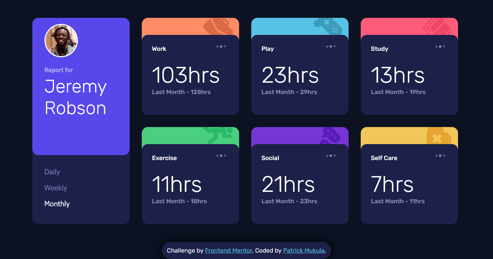

# Frontend Mentor - Time tracking dashboard solution

This is a solution to the [Time tracking dashboard challenge on Frontend Mentor](https://www.frontendmentor.io/challenges/time-tracking-dashboard-UIQ7167Jw). Frontend Mentor challenges help you improve your coding skills by building realistic projects. 

## Table of contents

- [Overview](#overview)
  - [The challenge](#the-challenge)
  - [Screenshot](#screenshot)
  - [Links](#links)
- [My process](#my-process)
  - [Built with](#built-with)
  - [What I learned](#what-i-learned)
  - [Continued development](#continued-development)
- [Author](#author)
- [Acknowledgments](#acknowledgments)


## Overview

### The challenge

Users should be able to:

- View the optimal layout for the site depending on their device's screen size
- See hover states for all interactive elements on the page
- Switch between viewing Daily, Weekly, and Monthly stats

### Screenshot



### Links

- Solution URL: https://github.com/Patfarmurs/time-tracking-dashboard
- Live Site URL: https://patfarmurs.github.io/time-tracking-dashboard/

## My process

### Built with

- Semantic HTML5 markup
- CSS custom properties
- Flexbox
- CSS Grid
- Mobile-first workflow
- Vanilla JavaScript (DOM manipulation, fetch API)
- JSON for data structure

### What I learned

Working on this project helped me solidify a number of front-end development concepts, especially when dealing with dynamic data rendering, responsive layout structuring, and DOM event management. A few specific takeaways I’m proud of:

- Dynamically Updating the DOM

I learned how to fetch data from a local JSON file and update content based on user interaction with buttons. Here's a snippet that showcases my approach to syncing UI with timeframes:

```JS
function editTimeframe(cardElement, timeframe) {
  const timeframeLabels = {
    daily: "Yesterday",
    weekly: "Last Week",
    monthly: "Last Month",
  };

  timeframes.forEach((tf) => {
    if (cardElement.id === tf.cardID) {
      cardElement.querySelector(".current").textContent = `${tf.tf[timeframe].current}hrs`;
      cardElement.querySelector(".previous").textContent = `Last ${capitalize(timeframe)} - ${tf.tf[timeframe].previous}hrs`;
    }
  });
}
```
- Debugging Identifier Mismatches
A subtle but important lesson: being cautious with string formatting and case sensitivity, especially when matching IDs between HTML and dynamically generated values in JavaScript.
// Fix to ensure 'Self Care' becomes 'self-care' for DOM matching

```js
cardID: cardData.title.toLowerCase().replace(" ", "-")
```

- Writing Modular and Readable CSS
Breaking up styling into separate files (style.css and timeframe-card.css) helped me keep code organized and focused. Here's a class I'm especially happy with:

```css
.timeframe-card {
  border-radius: 12px;
  padding: 1.5rem;
  background-color: var(--card-bg);
  transition: all 0.3s ease-in-out;
}
```


### Continued development

As I build more data-driven interfaces, I want to optimize DOM updates, loading times, and responsiveness—especially important for real-world deployment scenarios.


## Author

- Website - [Patrick Mukula](https://patfarmurs.github.io/Building-a-Portfolio/)
- Frontend Mentor - [Patfarmurs](https://www.frontendmentor.io/profile/Patfarmurs)


## Acknowledgments

- A huge thanks to Frontend Mentor for providing such thoughtful and well-designed challenges that sharpen real-world frontend skills.
- Special appreciation to tortiman for the inspiration—browsing their solution gave me new perspectives on layout structure and data handling techniques.
- And lastly, cheers to the broader developer community whose shared code, articles, and insight continue to guide my learning every step of the way.
